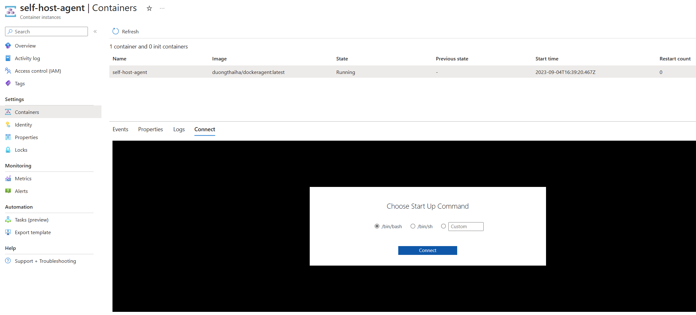

# Building image with containerised self-hosted Azure DevOps (ADO) agent with private access Azure Container Registry (ACR)

## Introduction

Containerization has revolutionized the way we deploy and manage software. By packaging applications and their dependencies into a container, we can ensure that our software will run consistently across different environments. This is particularly useful when it comes to setting up self-hosted agents for Azure Pipelines.
A self-hosted agent is an agent that you set up and manage on your own to run jobs. You can use self-hosted agents in Azure Pipelines or Git Hub Actions. Self-hosted agents give you more control to install dependent software needed for your builds and deployments.

## Why use containerised self-hosted agent

As we have seen the benefit of running the workload in container including agility, portability, high density and more. By running your self-hosted agent in a container, you can take advantage of the benefits of containerization.

* Agility: you can easily spin up new instances of your agent as needed, without having to worry about manually installing dependencies or configuring the environment. This can save you time and effort.
* Portable: Each engineering team can have autonomy and their own build agent in manage their pipeline. This help ensure that team’s builds and deployments are consistent.
* High density: Running your self-hosted agent in a container can make it easier to manage your infrastructure. Since containers are lightweight and portable, you can easily move your agents between different hosts as needed. This can help you optimize resource usage and reduce costs.

## What are the challenges of using containerised self-hosted agent?

As part of CI/CD building workload container images is a key capability. It is possible to run Docker tasks on containerised selfhost agent however it does require access to the docker daemon at host level. This has critical security concerns.

A solution is to use Azure Container Registry (ACR) Task. With ACR Tasks, you can use Azure Container Registry to build container images for various platforms in the cloud. ACR Tasks also lets you automate the process of updating your Docker containers with OS and framework patches.

By default, Azure container registry accepts connections over the internet from hosts on any network. This opens an attack surface, and it is not normally in acceptable in enterprise environment. ACR Task use an agent running on Azure and required appropriated permission to able communicate with the Azure Container registry.

## Proposed solution

There are a wide range of options to run containerized self-hosted agents on Azure from Azure Kubernetes Service to Azure Container App. This proof of concept Demonstrates the building of container images using self-hosted agent using Azure Container Instances with Azure Container Registry with private access only.

### Architecture


### Proof of concept

The proof of concept is all written in Bicep, and it provision the following:

* Provision a virtual network two subnets, one for Azure Container Instance and the other for Azure Container Registry
* Private DNS zone and entries
* Provision Azure Container Registry with private endpoint
* Disable public access to Azure Container Registry
* Provision Azure DevOps self-hosted agent in Azure Container Instances
* Provision an Azure Container Registry Task to build a container image.
* Custom role definition and role assignment following minimum privilege principles.

#### Prerequisite

ADO Organization and a PAT token for more details permission required please refer to [Run a self-hosted agent in Docker - Azure Pipelines | Microsoft Learn](https://learn.microsoft.com/en-us/azure/devops/pipelines/agents/docker?view=azure-devops)

GitHub Repo and Token for more detail permission required please refer to [Managing your personal access tokens - GitHub Docs](https://docs.github.com/en/authentication/keeping-your-account-and-data-secure/managing-your-personal-access-tokens)

#### Deployment Steps

Update the parameter file to include the correct parameters:

``` bicep

using './main.bicep'

param AZP_URL = '' // DevOps URL
param AZP_TOKEN = ''// PAT Token for the Azure DevOps
param GIT_TOKEN = '' // GitHub PAT Token
param GIT_REPO = '' // GitHub URL
```

Run the command to deploy the resource:

``` bicep
az group create -n <resource-group-name> -l <location>
az deployment group create --template-file main.bicep -g <resource-group-name> --parameters main.bicepparam
```

To start the image build process, we can connect to self-host agent using Connect capability in Azure Container Registry
 

Run the command to trigger build task.

``` cli
az login --identity
az acr task run --resource-group <resource-group-name> --registry <acr-name> --name build-task
``` 

 

From figure above you can see that self-host agent has successfully build the image and upload the image into the Azure Container Registry

## Summary

If you are considering setting up a self-hosted agent for Azure Pipelines, it’s definitely worth considering running it in a container and using an Azure Container Registry with public access disabled for building images with ACR Tasks.

## Related Content

* [Run a self-hosted agent in Docker - Azure Pipelines | Microsoft Learn](https://learn.microsoft.com/en-us/azure/devops/pipelines/agents/docker?view=azure-devops)
* [Managing your personal access tokens - GitHub Docs](https://docs.github.com/en/authentication/keeping-your-account-and-data-secure/managing-your-personal-access-tokens)
* [Run a self-hosted agent in Docker - Azure Pipelines | Microsoft Learn](https://learn.microsoft.com/en-us/azure/devops/pipelines/agents/docker?view=azure-devops)
* [ACR Tasks overview - Azure Container Registry | Microsoft Learn](https://learn.microsoft.com/en-us/azure/container-registry/container-registry-tasks-overview)
